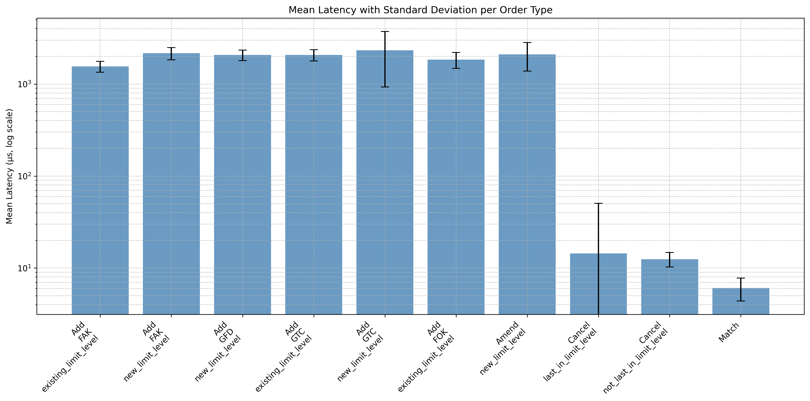

# ⚡ Low-Latency Order Book Matching Engine (C++17)

A high-performance, low-latency order book written in modern C++ that supports multiple order types with realistic price-time priority matching. The project also includes a Python-based system to generate randomized order streams and analyze engine performance.

---

## 🚀 Features

- 🔁 Supports common order types:
  - `GTC` (Good-Till-Cancel)
  - `FAK` (Fill-And-Kill)
  - `FOK` (Fill-Or-Kill)
  - `GFD` (Good-For-Day)
  - `M` (Market Orders)

- ⏱️ **Low latency** by design:
  - Uses `std::map` (balanced binary tree) for bid/ask levels → **O(log n)** for new price levels.
  - Uses `std::list` (double linked list) for FIFO order queues → **O(1)** for modifying/canceling orders at existing price levels.
  - Ensures **Price-Time Priority** for matching.

- 📊 Integrated analysis pipeline in Python:
  - Generates random orders
  - Executes them in C++
  - Collects and analyzes latency statistics

---

## ⏱️ Latency Statistics

<div style="display: flex; justify-content: space-between;">
  
</div>

---

## 🔁 Example: Input Orders (`orders.json`)

```json
[
  {
    "type": "GFD",
    "side": "Ask",
    "price": 46.09,
    "shares": 559
  },
  {
    "type": "GTC",
    "side": "Bid",
    "price": 39.75,
    "shares": 47
  }
]
```

---

## 🔁 Example: Output Statistics (`stats.json`)

```json
[
  {
    "type": "GFD",
    "side": "Ask",
    "price": 46.09,
    "shares": 559
  },
  {
    "type": "GTC",
    "side": "Bid",
    "price": 39.75,
    "shares": 47
  }
]
```

---

## 📚 References

> The following resources were used solely for learning purposes.

- **Reference 1:**  
  <https://github.com/Tzadiko/Orderbook>

- **Reference 2:**  
  <https://github.com/brprojects/Limit-Order-Book>
